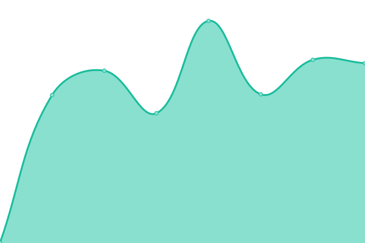
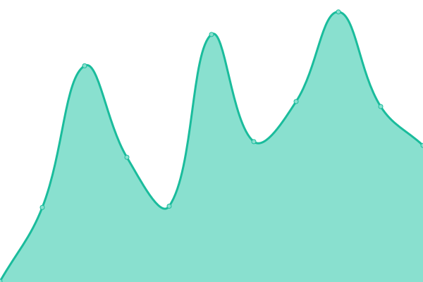

# [📈 Live Status](https://shiermann.github.io/upptime): <!--live status--> **🟩 All systems operational**

This repository contains the open-source uptime monitor and status page for [Stefan Hiermann](stefan.hiermann.at), powered by [Upptime](https://github.com/upptime/upptime).

With [Upptime](https://upptime.js.org), you can get your own unlimited and free uptime monitor and status page, powered entirely by a GitHub repository. We use [Issues](https://github.com/shiermann/upptime/issues) as incident reports, [Actions](https://github.com/shiermann/upptime/actions) as uptime monitors, and [Pages](https://shiermann.github.io/upptime) for the status page.

<!--start: status pages-->
<!-- This summary is generated by Upptime (https://github.com/upptime/upptime) -->
<!-- Do not edit this manually, your changes will be overwritten -->
<!-- prettier-ignore -->
| URL | Status | History | Response Time | Uptime |
| --- | ------ | ------- | ------------- | ------ |
|  [BMHME](https://bmhme.at) | 🟩 Up | [bmhme.yml](https://github.com/shiermann/upptime/commits/HEAD/history/bmhme.yml) | 

 2511ms
     
 | 

<a href="https://shiermann.github.io/upptime/history/bmhme">100.00%</a>
    

|  [Musikschule Donauland](https://musikschule-donauland.at/) | 🟩 Up | [musikschule-donauland.yml](https://github.com/shiermann/upptime/commits/HEAD/history/musikschule-donauland.yml) | 

 1176ms
     
 | 

<a href="https://shiermann.github.io/upptime/history/musikschule-donauland">100.00%</a>
    

|  [Musikverein Margarethen am Moos](http://www.mv-margarethen.at/) | 🟩 Up | [musikverein-margarethen-am-moos.yml](https://github.com/shiermann/upptime/commits/HEAD/history/musikverein-margarethen-am-moos.yml) | 

 598ms
     
 | 

<a href="https://shiermann.github.io/upptime/history/musikverein-margarethen-am-moos">100.00%</a>
    

|  [Österreichischer Blasmusikverband](https://www.blasmusik.at/) | 🟩 Up | [oesterreichischer-blasmusikverband.yml](https://github.com/shiermann/upptime/commits/HEAD/history/oesterreichischer-blasmusikverband.yml) | 

 2313ms
     
 | 

<a href="https://shiermann.github.io/upptime/history/oesterreichischer-blasmusikverband">100.00%</a>
    

|  [Google](https://www.google.com) | 🟩 Up | [google.yml](https://github.com/shiermann/upptime/commits/HEAD/history/google.yml) | 

 87ms
     
 | 

<a href="https://shiermann.github.io/upptime/history/google">100.00%</a>
    

|  [Wikipedia](https://en.wikipedia.org) | 🟩 Up | [wikipedia.yml](https://github.com/shiermann/upptime/commits/HEAD/history/wikipedia.yml) | 

 214ms
     
 | 

<a href="https://shiermann.github.io/upptime/history/wikipedia">100.00%</a>
    

|  [DuckDuckGo](https://www.duckduckgo.com) | 🟩 Up | [duck-duck-go.yml](https://github.com/shiermann/upptime/commits/HEAD/history/duck-duck-go.yml) | 

 114ms
     
 | 

<a href="https://shiermann.github.io/upptime/history/duck-duck-go">100.00%</a>
    

<!--end: status pages-->

[**Visit our status website →**](https://shiermann.github.io/upptime)

## 📄 License

- Powered by: [Upptime](https://github.com/upptime/upptime)
- Code: [MIT](./LICENSE) © [Stefan Hiermann](stefan.hiermann.at)
- Data in the `./history` directory: [Open Database License](https://opendatacommons.org/licenses/odbl/1-0/)
